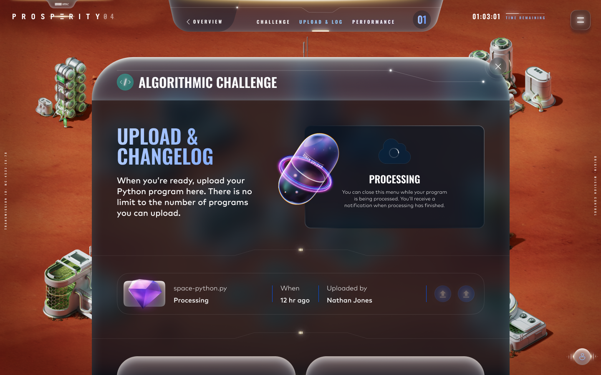
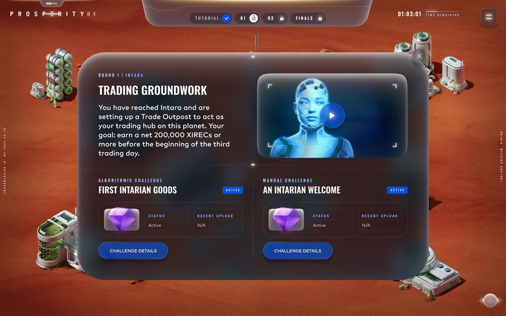
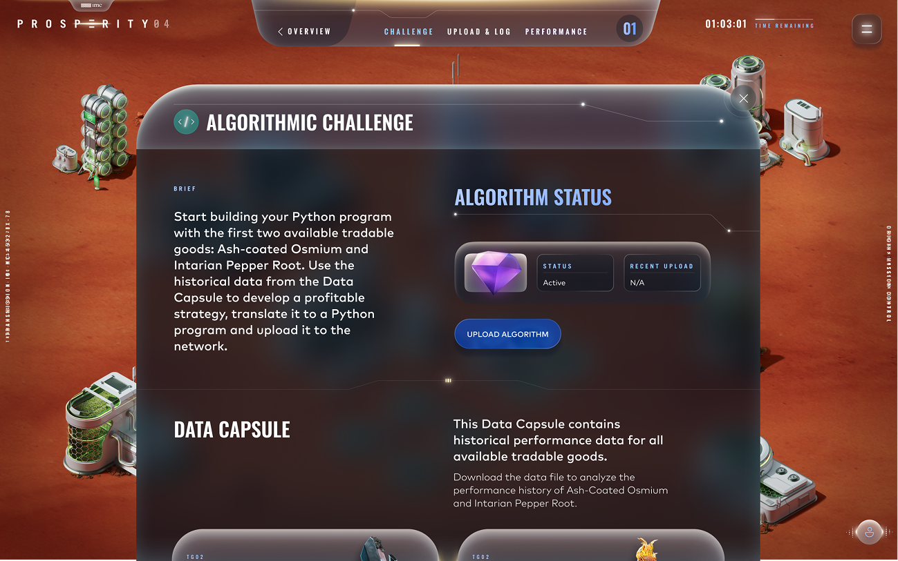
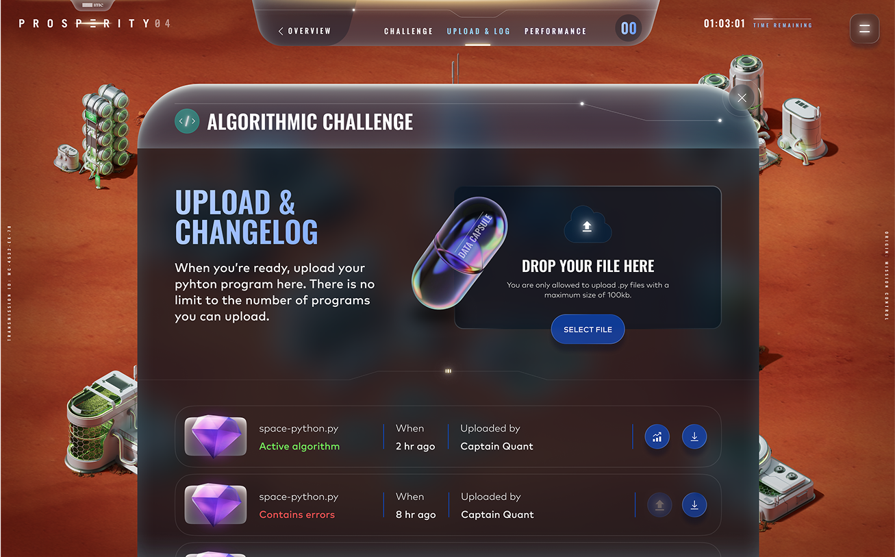
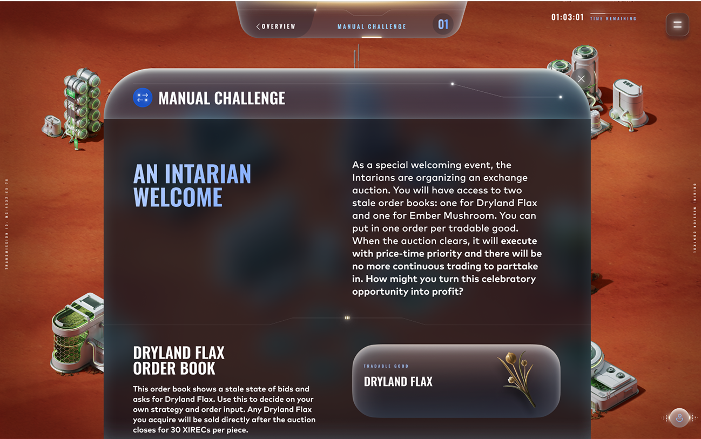
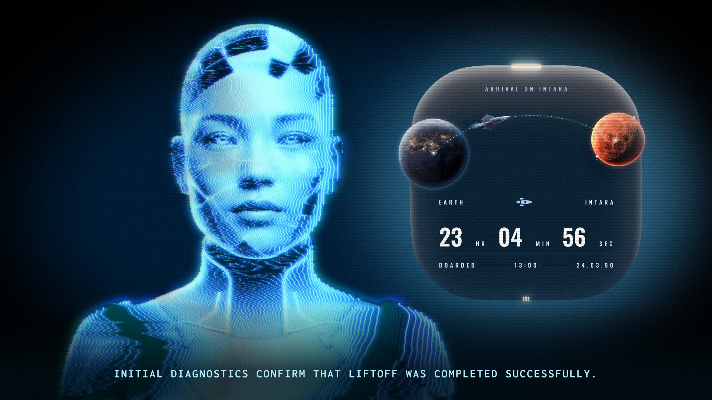
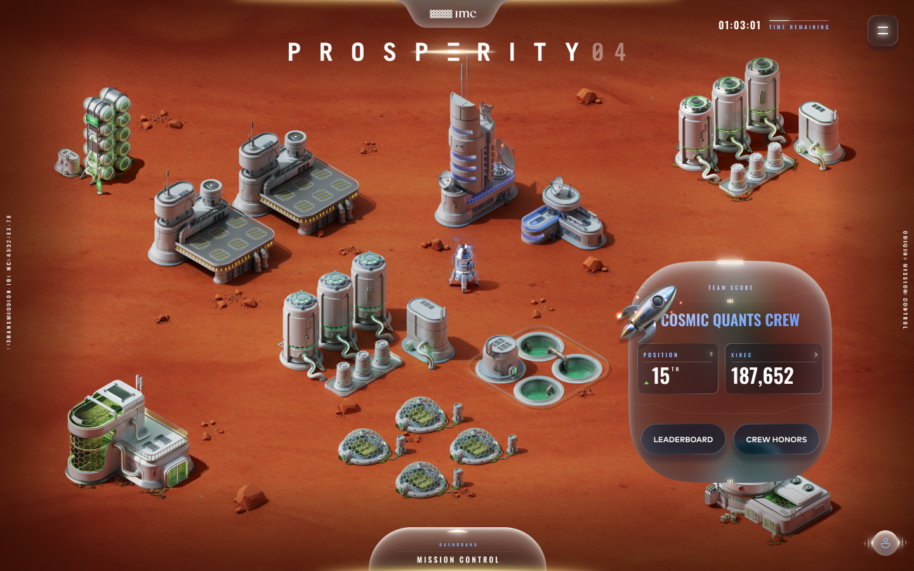
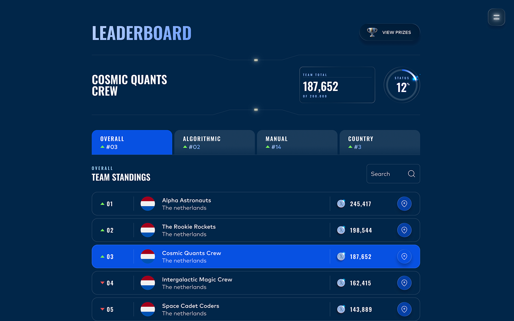
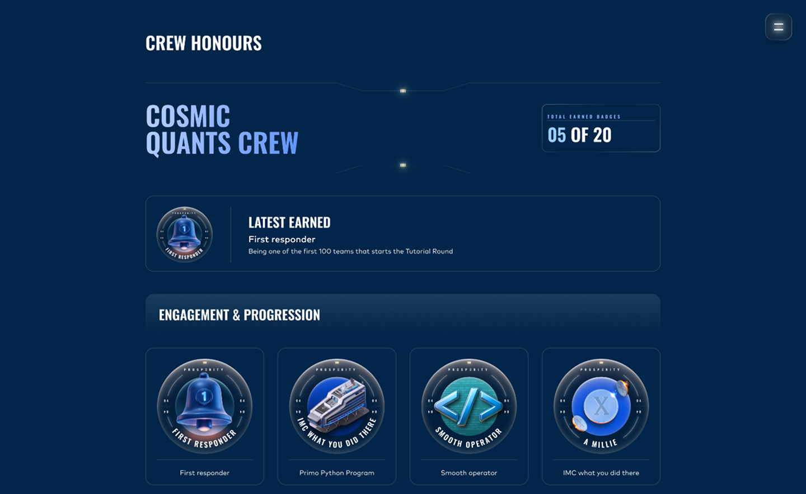
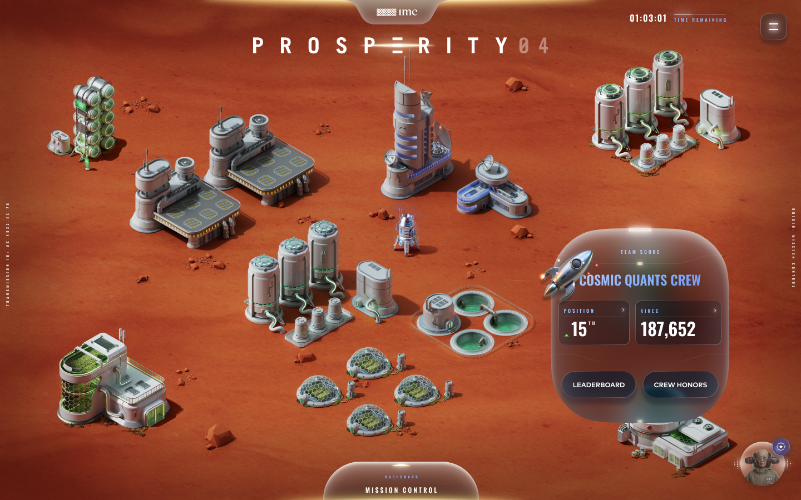

# Game Mechanics Overview

# Rounds

The 16 days of simulation of Prosperity are divided into 5 rounds. Rounds 1 and 2 last 72 hours, while rounds 3, 4, and 5 each last 48 hours.

At the end of every round - before the timer runs out - all teams will have to submit their algorithmic and manual trades to be processed. The algorithms will then participate in a full day of trading against the Prosperity trading bots. Note that all algorithms are trading separately, there is no interaction between the algorithms of different players. When a new round starts, the results of the previous round will be disclosed and the leaderboard will be updated accordingly. During the game, you can always visit previous rounds in the dashboard, to review information and results. But once a round is closed, you can no longer change your submitted trader for that round. When Round 5 ends, the final results will be processed and the winner of the Prosperity trading challenge will be announced within 2 weeks.

### Algorithmic trading

Every round contains an algorithmic trading challenge. You will have to submit your (final) Python program before the trading round ends. When the round ends, the last successfully processed submission will be locked in and processed for results. 

Uploading your program is as simple as dragging it into the XIREN capsule

### Manual trading

Every round also contains a manual trading challenge taking place at the same time. Similar to the algorithmic trading rounds, the last submission will be locked in and processed for results when the round ends. During the tutorial round, manual trading is inactive. Manual trades have no effect on your algorithmic trade and can be seen as separate challenges to gain additional profits. 

# Dashboard

## Algorithmic trading submissions

Submitting your algorithmic trading program (your Python program) is easily done through the Mission Control dashboard, by clicking the “Challenge Details” button under the Algorithmic Challenge. 

An Algorithmic Challenge Overview window will open where you can find all the essential information to build your Python program with, including the Data Capsule containing all the historical trade data for the available tradable goods.

 

Clicking the “Upload Algorithm” button will open the Upload and Changelog window where you can drag and drop your file or search for it through a file browser. Here, you can also find all the previously uploaded programs with their respective status and who uploaded them. You can even download the debug logs.

You and your team can upload as many Python programs as you please, but only the one active algorithm will be processed and executed at the end of the round.

## Manual trading submissions

Submitting your manual trades is done through the Manual Challenge Overview window, by clicking the “Challenge Details” button under the Algorithmic Challenge. 

An Manual Challenge Overview window will open where you can find all the essential information to perform your manual trades. You will input your submissions directly in this window. 

You and your team can (re)submit strategies as many times as you please, but only the last submitted trade will be processed and executed at the end of the round.

# A.R.I.A. Uplinks

A.R.I.A. Uplinks are your main source of information for Prosperity. The Autonomous Relay Interface Assistant, A.R.I.A. for short, will guide you through all the essential information for your Algorithmic and Manual trading activities. A new Uplink will be available at the beginning of every round. 

# Outpost View

The outpost View is where you have a clear overview of your outpost and all the structures your team has unlocked by generating XIRECs profit. The more profit you make, the bigger your outpost will grow. 

This overview shows your team name, PnL indicator (generated profit and loss) and overall rank on the leaderboard. Below it are direct links to the Leaderboard and the Crew Honors overview. At the bottom of the Outpost View, you’ll find the Mission Control. Clicking it will open the Mission Control window. 

# Leaderboard

The Leaderboard shows the ranking of all competing teams in Prosperity 4. The most important ranking is the Overall ranking, showing total PnL per team and corresponding rankings. Clicking the “Algorithmic” tab will show the ranking based on generated profit for Algorithmic trading performance only. Clicking the “Manual” tab will show the ranking based on generated profit for Manual trading performance only. Clicking the “Country” tab will show your teams ranking compared to other teams with the same team country set.  

# Crew Honors

While you play Prosperity, you can earn badges for all sorts of actions and achievements. All the badges you collect can be viewed on the Crew Honors page. You can acces your Crew Honors through the Outpost View or the main menu. 

All your collected badges can be shared with the world easily by clicking on the badge and using one of the share buttons in the description. Let the world now that you’re crushing it in Prosperity!

## On-Board Advisors

You have the opportunity to take a dedicated On-Board Advisor with you on your trading missions. You can choose one out of three available Advisors during the Tutorial Round. You may switch Advisors for as long as the Tutorial Round lasts. As soon as the Tutorial Round ends, your selection will be locked in and you can no longer switch On-Board advisors. 

From the start of round 1 onwards, these On-Board Advisors will provide interesting perspectives on the challenges that you’ll face and provide guidance to help you make your mission a success. Make sure to consult them whenever you’re looking for advise. 

The On-Board Advisor is located in the bottom right corner of your Outpost View. 

